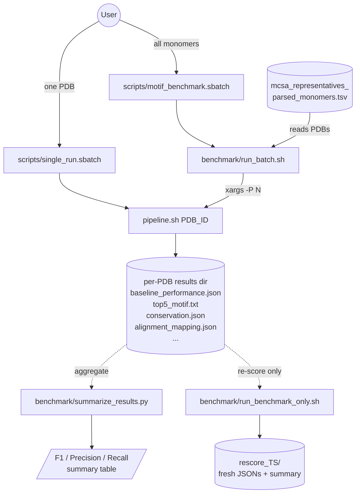
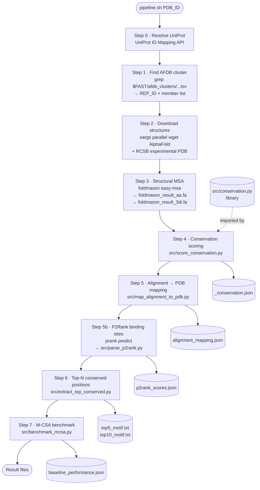

# Workflow

Visual reference for how the motif-discovery pipeline is invoked and what
each step does. Diagrams are written in [Mermaid](https://mermaid.js.org/) —
they render natively on GitHub and in VS Code with the *Markdown Preview
Mermaid Support* extension.

## 1. Orchestration

How a run gets started, persisted, aggregated, or re-scored.

## 2. Inside `pipeline.sh`

The per-PDB steps, in order.

