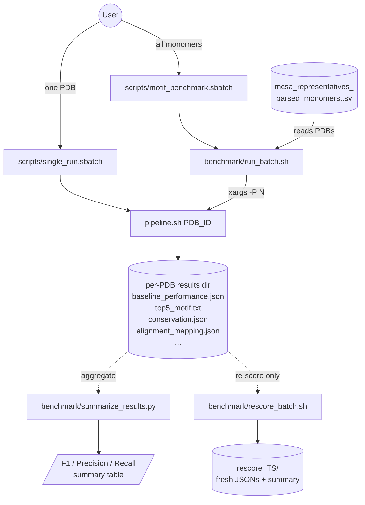
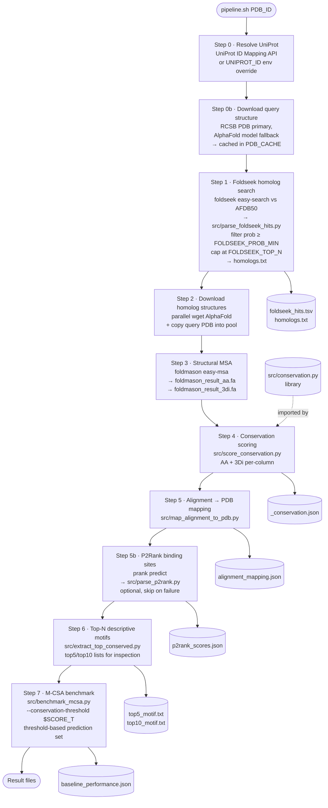
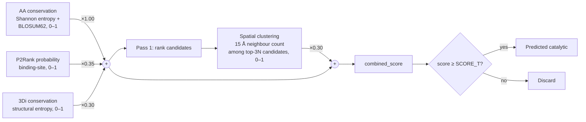

# Workflow

Visual reference for how the motif-discovery pipeline is invoked and what
each step does. Diagrams are written in [Mermaid](https://mermaid.js.org/) —
they render natively on GitHub and in VS Code with the *Markdown Preview
Mermaid Support* extension.

## 1. Orchestration

How a run gets started, persisted, aggregated, or re-scored.

```mermaid
flowchart TD
    User((User))
    User -->|one PDB| SR[scripts/single_run.sbatch]
    User -->|all monomers| MB[scripts/motif_benchmark.sbatch]

    SR --> PS[pipeline.sh PDB_ID]

    MB --> RB[benchmark/run_batch.sh]
    TSV[(mcsa_representatives_<br/>parsed_monomers.tsv)] -->|reads PDBs| RB
    RB -->|xargs -P N| PS

    PS --> Out[(per-PDB results dir<br/>baseline_performance.json<br/>top5_motif.txt<br/>conservation.json<br/>alignment_mapping.json<br/>...)]

    Out -.aggregate.-> SR2[benchmark/summarize_results.py]
    Out -.re-score only.-> RBO[benchmark/rescore_batch.sh]

    SR2 --> Table[/F1 / Precision / Recall<br/>summary table/]
    RBO --> RescoreOut[(rescore_TS/<br/>fresh JSONs + summary)]
```

## 2. Inside `pipeline.sh`

The per-PDB steps, in order. Default workflow is foldseek-based homolog
search against AFDB50. The legacy AFDB-cluster-lookup workflow is preserved
as commented-out code in STEP 1 for the future "analyse a given AFDB
cluster" use case.

```mermaid
flowchart TD
    Start([pipeline.sh PDB_ID]) --> S0
    S0[Step 0 · Resolve UniProt<br/>UniProt ID Mapping API<br/>or UNIPROT_ID env override] --> S0b
    S0b[Step 0b · Download query structure<br/>RCSB PDB primary,<br/>AlphaFold model fallback<br/>→ cached in PDB_CACHE] --> S1
    S1[Step 1 · Foldseek homolog search<br/>foldseek easy-search vs AFDB50<br/>→ src/parse_foldseek_hits.py<br/>filter prob ≥ FOLDSEEK_PROB_MIN<br/>cap at FOLDSEEK_TOP_N<br/>→ homologs.txt] --> S2
    S2[Step 2 · Download homolog structures<br/>parallel wget AlphaFold<br/>+ copy query PDB into pool] --> S3
    S3[Step 3 · Structural MSA<br/>foldmason easy-msa<br/>→ foldmason_result_aa.fa<br/>→ foldmason_result_3di.fa] --> S4
    S4[Step 4 · Conservation scoring<br/>src/score_conservation.py<br/>AA + 3Di per-column] --> S5
    S5[Step 5 · Alignment → PDB mapping<br/>src/map_alignment_to_pdb.py] --> S5b
    S5b[Step 5b · P2Rank binding sites<br/>prank predict<br/>→ src/parse_p2rank.py<br/>optional, skip on failure] --> S6
    S6[Step 6 · Top-N descriptive motifs<br/>src/extract_top_conserved.py<br/>top5/top10 lists for inspection] --> S7
    S7[Step 7 · M-CSA benchmark<br/>src/benchmark_mcsa.py<br/>--conservation-threshold $SCORE_T<br/>threshold-based prediction set] --> Done([Result files])

    Lib[(src/conservation.py<br/>library)] -.imported by.-> S4

    S1 --> J1[(foldseek_hits.tsv<br/>homologs.txt)]
    S4 --> J4[(_conservation.json)]
    S5 --> J5[(alignment_mapping.json)]
    S5b --> J5b[(p2rank_scores.json)]
    S6 --> J6[(top5_motif.txt<br/>top10_motif.txt)]
    S7 --> J7[(baseline_performance.json)]
```

## 3. Scoring signals in STEP 7

How the per-residue `combined_score` is built up inside
`src/benchmark_mcsa.py`. Predicted catalytic set = all residues with
`combined_score ≥ SCORE_T`.

```mermaid
flowchart LR
    AA[AA conservation<br/>Shannon entropy +<br/>BLOSUM62, 0–1] -->|×1.00| Sum((+))
    P2[P2Rank probability<br/>binding-site, 0–1] -->|×0.35| Sum
    Di[3Di conservation<br/>structural entropy, 0–1] -->|×0.30| Sum
    Sum --> Pass1[Pass 1: rank candidates]
    Pass1 --> Cluster[Spatial clustering<br/>15 Å neighbour count<br/>among top-3N candidates, 0–1]
    Cluster -->|×0.30| Sum2((+))
    Sum --> Sum2
    Sum2 --> Score[combined_score]
    Score --> Cut{score ≥ SCORE_T?}
    Cut -- yes --> Pred[Predicted catalytic]
    Cut -- no --> Drop[Discard]
```

## 4. Key tunables

Environment variables that change pipeline behaviour without code edits:

| Variable | Default | What it does |
|---|---|---|
| `FOLDSEEK_DB` | `/fast/databases/foldseek/afdb/afdb50` | Foldseek target DB. Swap to `afdb50_gpu` for GPU acceleration or `afdb50_ca` for CA-only fast mode. |
| `FOLDSEEK_MAX_SEQS` | `1000` | `foldseek --max-seqs` (raw hit pool before filtering). |
| `FOLDSEEK_PROB_MIN` | `0.8` | Minimum foldseek `prob` to keep a hit. |
| `FOLDSEEK_TOP_N` | `200` | Cap on filtered hits → size of homolog pool. |
| `SCORE_T` | `1.0` | Combined-score threshold for catalytic prediction. Sweep this. |
| `DOWNLOAD_JOBS` | `8` | Parallel AlphaFold downloads (lower if running many pipelines concurrently). |
| `UNIPROT_ID` | *(API)* | Manual override when the UniProt ID Mapping API is flaky. |

Set per-run via env: `SCORE_T=1.2 FOLDSEEK_PROB_MIN=0.7 bash pipeline.sh 1BTL`.
